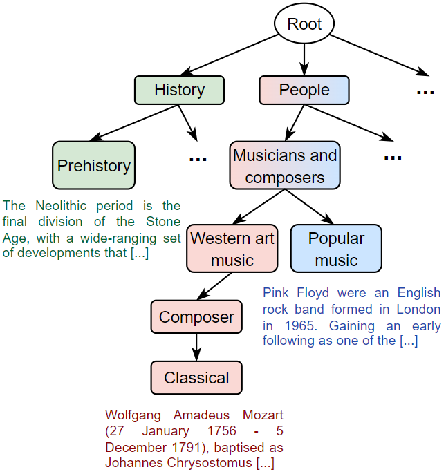

# Revisiting Hierarchical Text Classification: Inference and Metrics

**Official implementation of [Revisiting Hierarchical Text Classification: Inference and Metrics], CoNLL 2024.**

Based on [HITIN repo](https://github.com/Rooooyy/HiTIN).

## Abstract

Hierarchical text classification (HTC) is the task of assigning labels to a text within a structured space organized as a hierarchy. Recent works
treat HTC as a conventional multilabel classification problem, therefore evaluating it as such.
We instead propose to evaluate models based on specifically designed hierarchical metrics and we demonstrate the intricacy of metric choice and prediction inference method.  We introduce a new challenging dataset and we evaluate fairly, recent sophisticated models, comparing them with a range of simple but strong baselines, including a new theoretically motivated loss. Finally, we show that those baselines are very often competitive with the latest models. This highlights the importance of carefully considering the evaluation methodology when proposing new methods for HTC.

## Key features

### Hierarchical Wikivitals : a new challenging dataset

We present Hierarchical Wikivitals, a novel high-quality HTC dataset, extracted from Wikipedia. Equipped with a deep and complex hierarchy, it provides a harder challenge.

<p align="center">
    
</p>

### Logit adjusted softmax cross-entropy

<p align="center">
    \begin{equation*}
    \hat{\mathbb{P}}(y|x, \pi(y)) = \frac{e^{s_x^{[y]} + \tau\log\nu(y|\pi(y))}}{\underset{z\in\mathcal{C}(\pi(y))}{\sum}e^{s_x^{[z]} + \tau\log\nu(z|\pi(z))}} 
    \end{equation*}
</p>


### A fair methodology of evaluation

## Code implementation

### Installation

1. Clone the repository:
    ```bash
    git clone https://github.com/RomanPlaud/revisitingHTC.git
    cd revisitingHTC
    ```
2. Create and activate the conda environment:
    ```bash
    conda create -n revisiting_htc_env --file revisiting-htc.txt
    conda activate revisiting_htc_env
    ```

#### Dataset Preparation

Our newly introduced dataset is available [here](data/HWV). Feel free to use it for your experiments. This dataset is released under the MIT License.

##### Datasets
Obtain the RCV1, WOS, and BGC datasets by referring to:
- [HiTIN repo for RCV1 and WOS](https://github.com/Rooooyy/HiTIN/tree/master)
- [BGC dataset from this repo](https://gitlab.com/distration/dsi-nlp-publib/-/blob/main/htc-survey-22/src/dataset_tools/blurb/)

Ensure the datasets match the format:
```json
{
  "token": ["Sample input text"],
  "label": ["Category", "Subcategory", "Further Subcategory"]
}

```

In addition a taxonomy file (such as [hwv.taxonomy](data/HWV/hwv.taxonomy)) is required where each line represents a parent category followed by its children, separated by tabs. Ensure all labels used in the dataset are covered.

Example : 

```txt
Root	Science	Technology	Arts
Science	Physics	Chemistry	Biology
```

##### Tokenization 

For a faster running training you can tokenize your dataset. Here is how you should do with hwv dataset.

```shell
python3 tokenize_dataset.py --data_train_path data/HWV/hwv_train.json --data_test_path data/HWV/hwv_test.json --data_valid_path data/HWV/hwv_val.json --config_file data/HWV/config_hwv.json
```


##### Train

To reproduce the results of our article : 

```shell
bash bash_files/hwv/train_hwv_hitin_cond_softmax_la.sh
```

(or any other bash file contained in the folder bash_files)

NB: if you dataset is not tokenized please set "tokenized" to false in the config file and change the names of the paths to dataset


## License

This project and datasets is released under the MIT License.